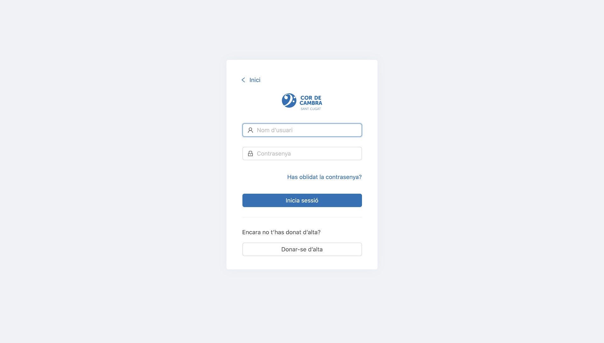
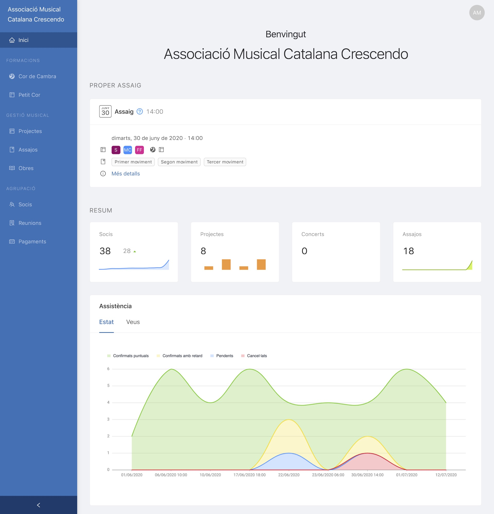
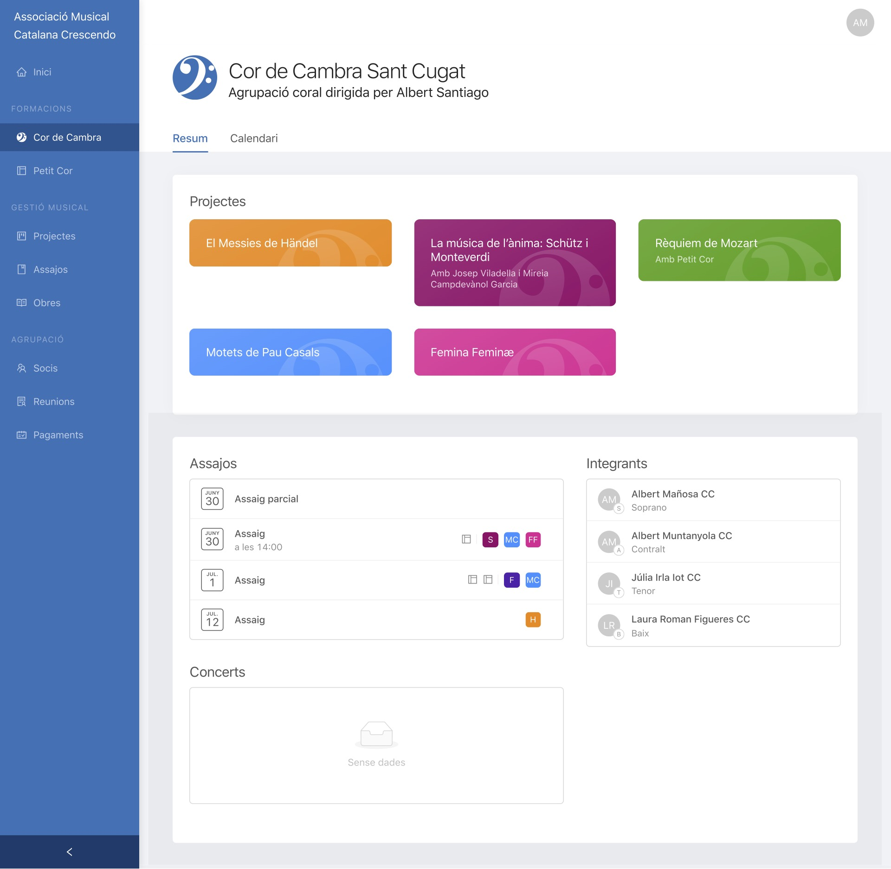
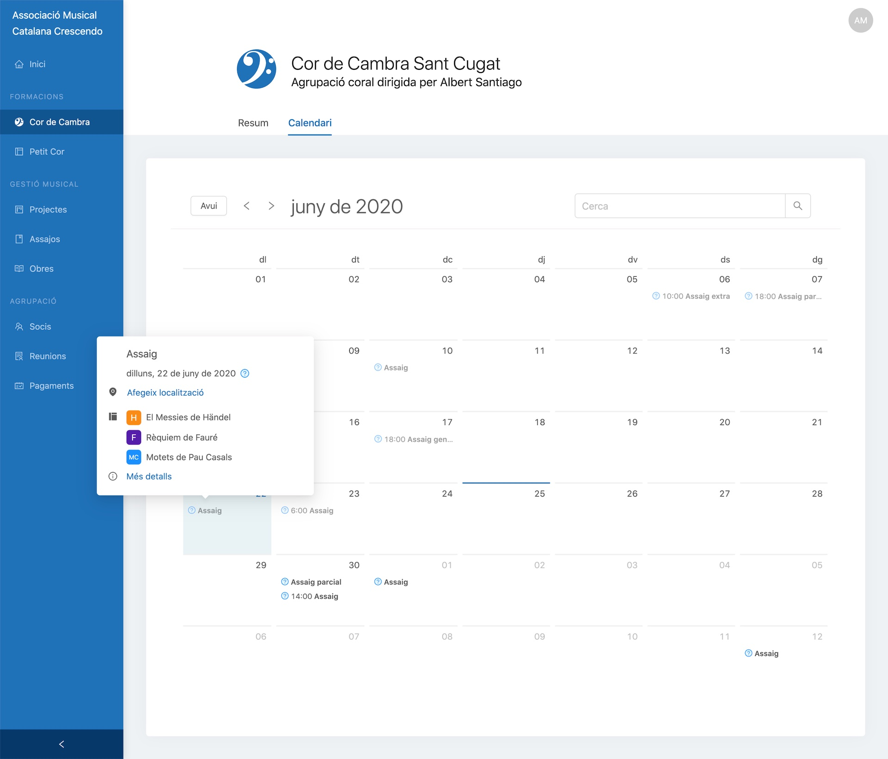
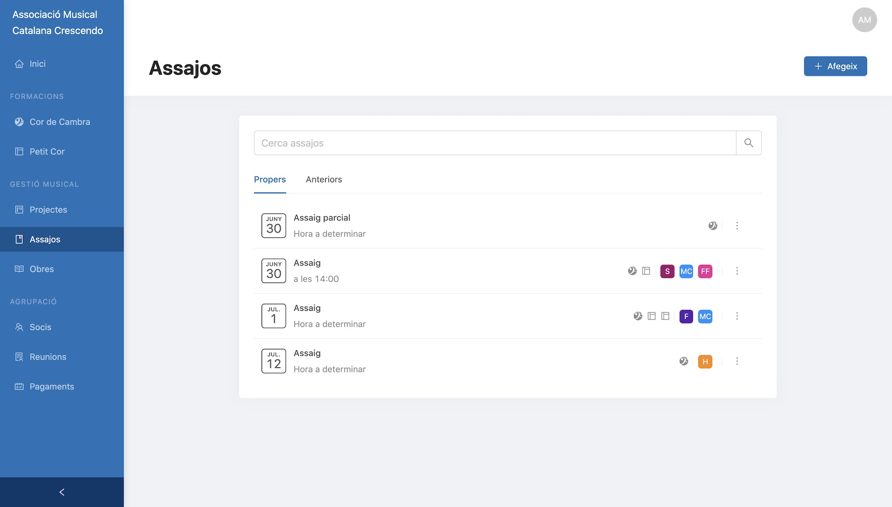
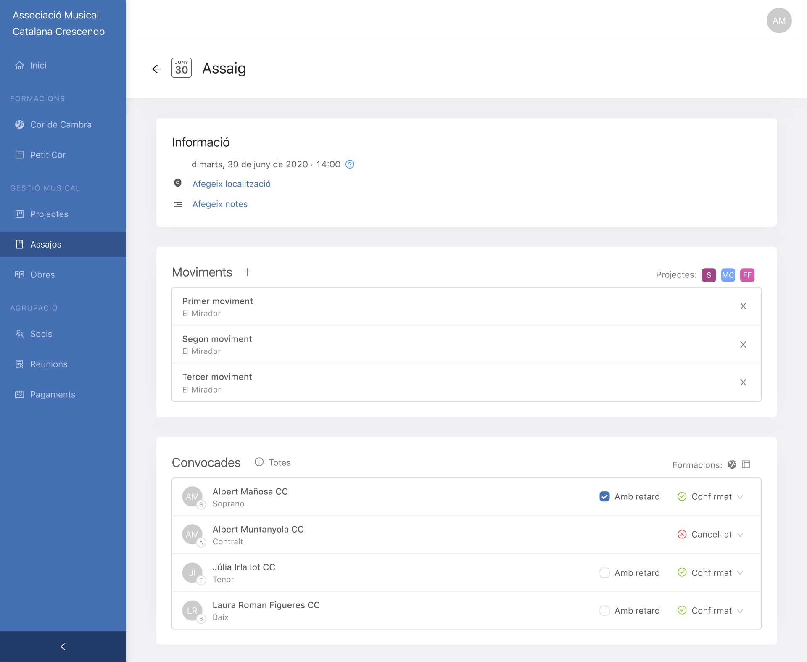
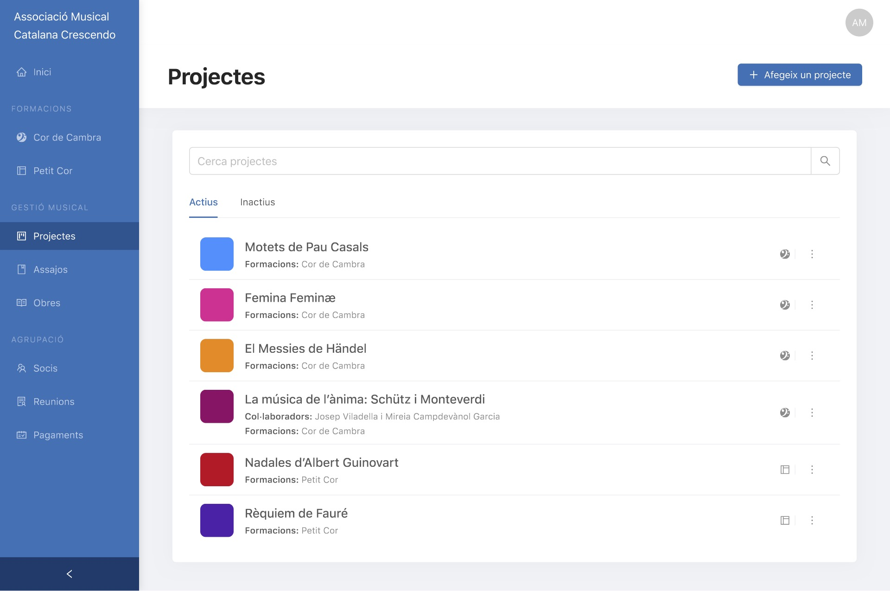

# Desenvolupament d’una aplicació web per a la gestió d’una associació musical

Projecte per a l’Associació Musical Catalana Crescendo i el Cor de Cambra Sant Cugat.

L’aplicació està disponible a [cordecambrasantcugat.herokuapp.com](https://cordecambrasantcugat.herokuapp.com).

## Base de dades

La documentació detallada de la base de dades es pot trobar a [DBDocs](https://dbdocs.io/albertms10/AMCC).

## Tauler

### Inici de sessió

### Benvinguda al tauler

### Formació

### Assajos

### Projectes

